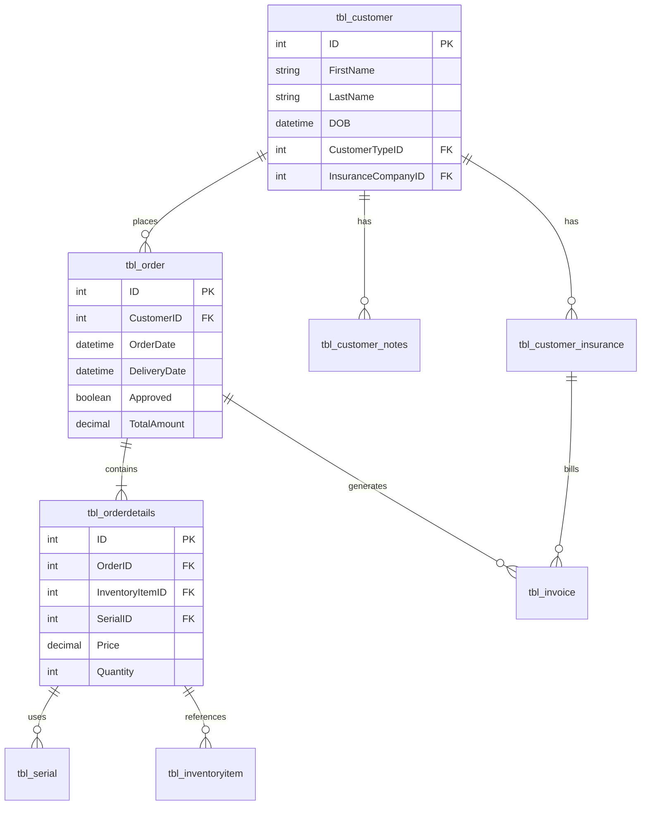
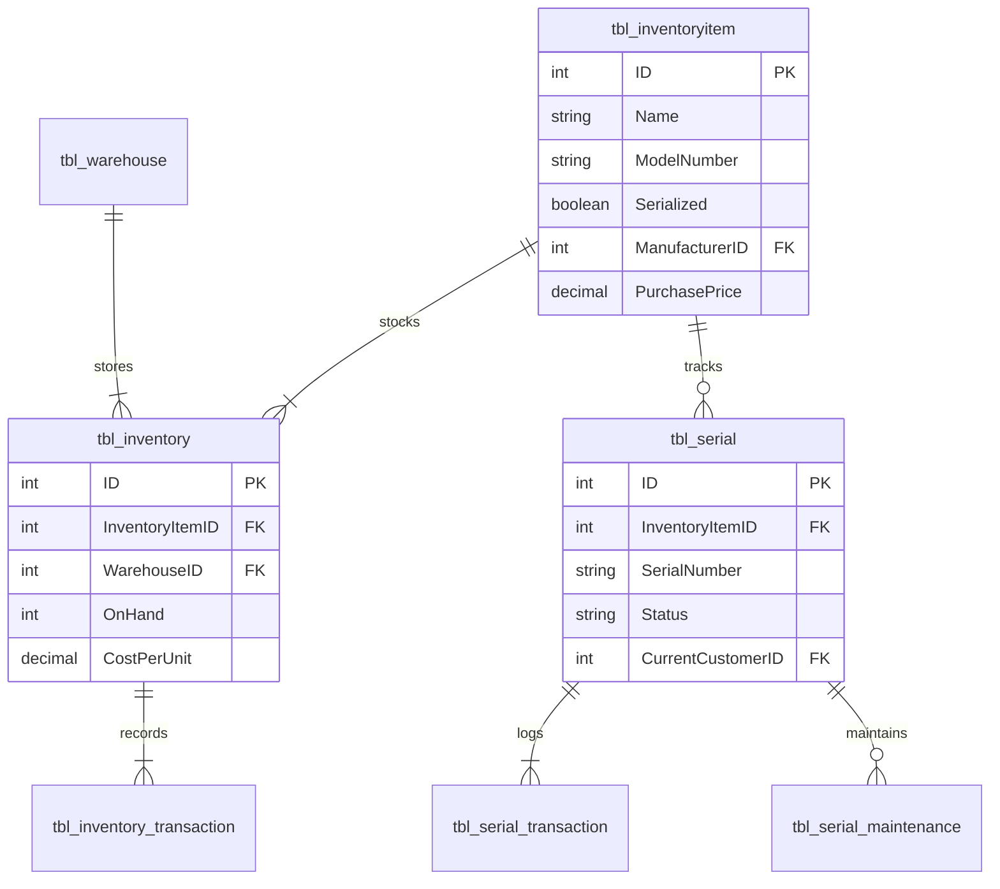
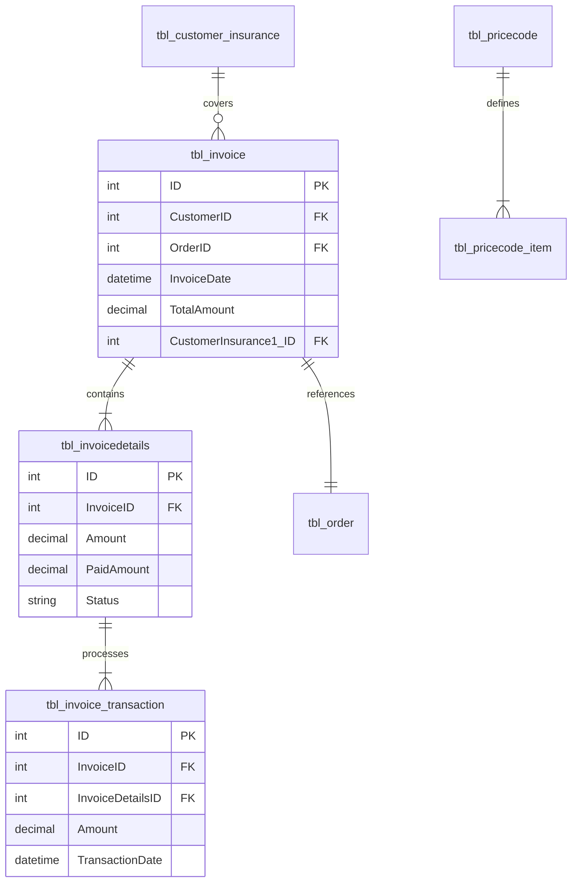
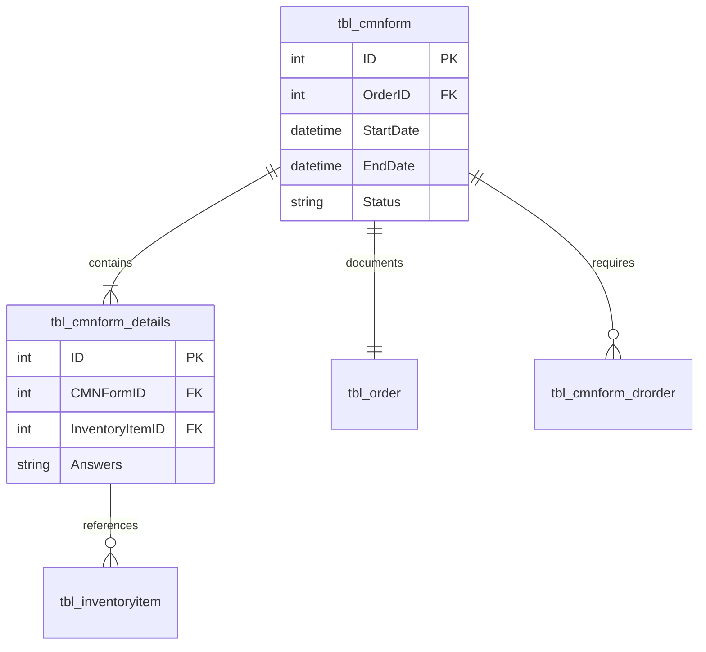

# Database Migration Plan

## 1. Schema Diagrams by Subsystem

### 1.1 Core Patient and Order Management

### 1.2 Inventory and Equipment Management

### 1.3 Billing and Insurance

### 1.4 Medical Documentation

## 2. Migration Priority List

### 2.1 Priority 1 - Core Customer and Order Tables
High complexity, critical business operations, most relationships

| Table Name | Columns | Rows | Complexity | Dependencies | Priority |
|------------|---------|------|------------|--------------|----------|
| tbl_customer | 104 | 49 | High | Primary | 1.1 |
| tbl_order | 50 | 346 | High | Primary | 1.2 |
| tbl_orderdetails | 67 | 433 | High | Primary | 1.3 |
| tbl_customer_insurance | 29 | 74 | Medium | Primary | 1.4 |

### 2.2 Priority 2 - Inventory Management
High transaction volume, critical for operations

| Table Name | Columns | Rows | Complexity | Dependencies | Priority |
|------------|---------|------|------------|--------------|----------|
| tbl_inventoryitem | 26 | 466 | High | Primary | 2.1 |
| tbl_inventory | 14 | 49 | Medium | Secondary | 2.2 |
| tbl_serial | 32 | 41 | High | Secondary | 2.3 |
| tbl_inventory_transaction | 19 | 342 | High | Secondary | 2.4 |

### 2.3 Priority 3 - Billing and Payments
Financial data, complex calculations

| Table Name | Columns | Rows | Complexity | Dependencies | Priority |
|------------|---------|------|------------|--------------|----------|
| tbl_invoice | 43 | 330 | High | Secondary | 3.1 |
| tbl_invoicedetails | 56 | 364 | High | Secondary | 3.2 |
| tbl_invoice_transaction | 18 | 614 | Medium | Secondary | 3.3 |
| tbl_pricecode_item | 39 | 513 | Medium | Secondary | 3.4 |

### 2.4 Priority 4 - Medical Documentation
Complex forms, regulatory compliance

| Table Name | Columns | Rows | Complexity | Dependencies | Priority |
|------------|---------|------|------------|--------------|----------|
| tbl_cmnform | 25 | 82 | High | Tertiary | 4.1 |
| tbl_cmnform_details | 14 | 74 | Medium | Tertiary | 4.2 |
| Multiple CMN form tables | varies | varies | Medium | Tertiary | 4.3 |

### 2.5 Priority 5 - Supporting Tables
Reference data, lower complexity

| Table Name | Columns | Rows | Complexity | Dependencies | Priority |
|------------|---------|------|------------|--------------|----------|
| tbl_warehouse | 13 | 2 | Low | Support | 5.1 |
| tbl_manufacturer | 14 | 2 | Low | Support | 5.2 |
| tbl_producttype | 4 | 18 | Low | Support | 5.3 |

## 3. Migration Phases

### Phase 1: Foundation (Weeks 1-2)
- Migrate core customer and order tables
- Set up basic PostgreSQL schema
- Implement primary keys and indexes
- Basic data validation

### Phase 2: Inventory (Weeks 3-4)
- Migrate inventory management system
- Implement serial number tracking
- Set up transaction logging
- Test inventory movements

### Phase 3: Financial (Weeks 5-6)
- Migrate billing system
- Implement payment processing
- Set up invoice generation
- Test financial calculations

### Phase 4: Medical Records (Weeks 7-8)
- Migrate CMN forms
- Implement form validation
- Set up medical documentation
- Test compliance requirements

### Phase 5: Support Systems (Weeks 9-10)
- Migrate reference tables
- Implement views
- Set up reporting
- Final testing and validation

## 4. Special Considerations

### 4.1 Data Volume Handling
- Tables over 400 rows require batch processing
- Consider parallel migration for large tables
- Implement validation checkpoints

### 4.2 Business Logic Migration
- 60 stored procedures need conversion
- 16 functions require PostgreSQL equivalents
- Complex calculations need thorough testing

### 4.3 Data Integrity
- Maintain referential integrity during migration
- Validate all foreign key relationships
- Ensure transaction consistency

### 4.4 Performance Optimization
- Index strategy for PostgreSQL
- Query optimization for complex views
- Connection pooling setup
